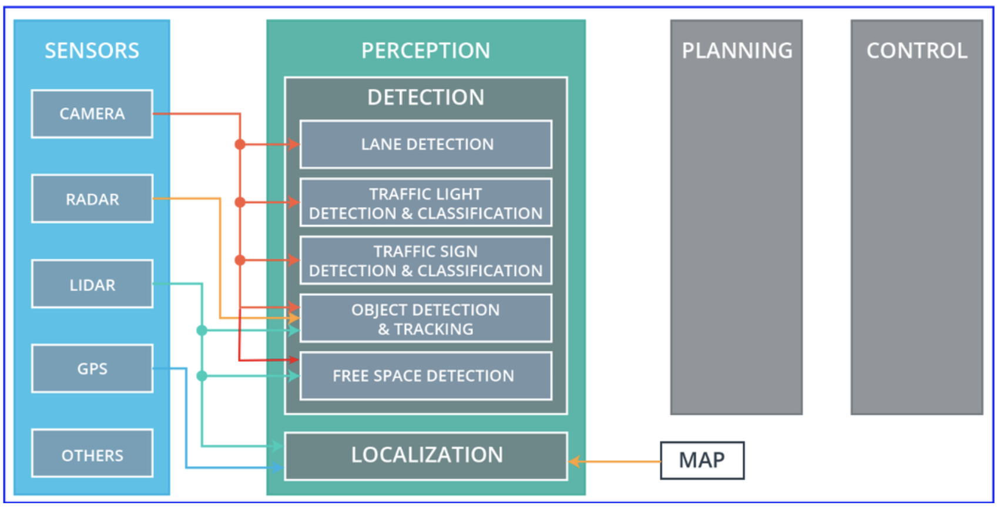
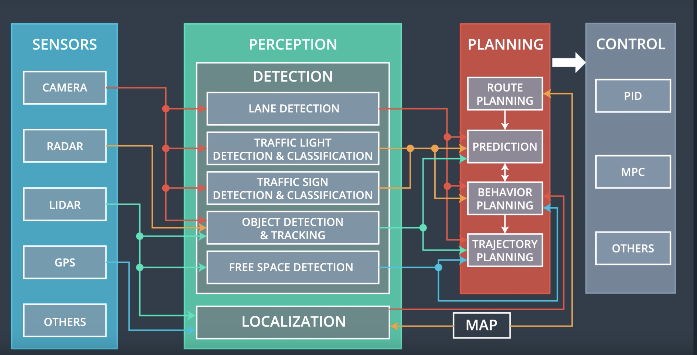

# sensor

# perception
1. localization
2. object detection, lane detection,
https://www.mdpi.com/1424-8220/16/3/280/htm
[Localizing Ground Penetrating RADAR: A Step Toward Robust Autonomous Ground Vehicle Localization](https://onlinelibrary.wiley.com/doi/full/10.1002/rob.21605)

# Planning
 route planning, prediction, behavioral planning, and path planning
## Route planning
The route planning component is responsible for high-level decisions about the path of the vehicle between two points on a map; for example which roads, highways, or freeways to take. This component is similar to the route planning feature found on many smartphones or modern car navigation systems.

## Prediction
The prediction component estimates what actions other objects might take in the future. For example, if another vehicle were identified, the prediction component would estimate its future trajectory.

## Behavioral planning
The behavioral planning component determines what behavior the vehicle should exhibit at any point in time. For example stopping at a traffic light or intersection, changing lanes, accelerating, or making a left turn onto a new street are all maneuvers that may be issued by this component.

## Trajectory planning
Based on the desired immediate behavior, the trajectory planning component will determine which trajectory is best for executing this behavior.

Have a look at the quizzes below to test your knowledge of the planning subsystem:

